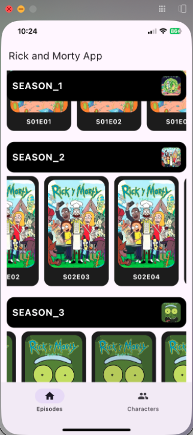
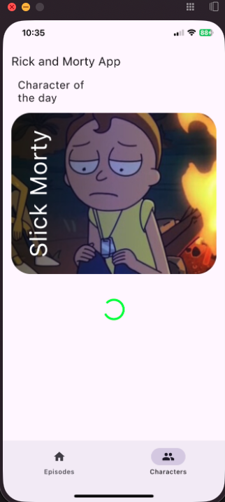
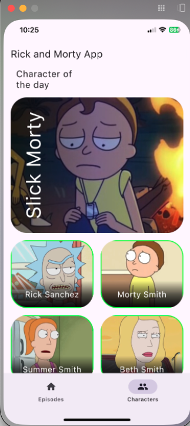
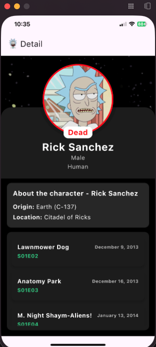

# 👽 MyRickAndMortyApp

Aplicación desarrollada con Kotlin Multiplatform para explorar el universo de Rick and Morty,
consultando temporadas, episodios y personajes desde una única base de código compartida entre
Android e iOS.

---

## 📱 Descripción

Aplicación que permite explorar el universo de Rick and Morty, mostrando las temporadas, sus
episodios y un apartado dedicado a los personajes, donde es posible consultar su información
detallada. Desarrollada con Kotlin Multiplatform, compartiendo la lógica entre Android e iOS desde
una única base de código.

## ✨ Características

- 📺 Consulta todas las temporadas de la serie.
- 🎬 Visualiza los episodios de cada temporada.
- 👥 Explora el listado de personajes.
- 🔍 Consulta el detalle e información de cada personaje.
- 📱 Multiplataforma: una sola base de código para Android e iOS.

## 📸 Capturas de pantalla

|                  Temporadas                   |                   Cargando personajes                    |
|:---------------------------------------------:|:--------------------------------------------------------:|
|  |  |

|                    Personajes                    |                 Detalle del personaje                  |
|:------------------------------------------------:|:------------------------------------------------------:|
|  |  |

## 🛠️ Stack tecnológico

- Kotlin Multiplatform (KMP) — lógica compartida entre plataformas.
- Android — cliente nativo.
- iOS — cliente nativo.

## 📄 Licencia

Este proyecto está bajo la licencia MIT. Consulta el archivo LICENSE para más detalles.